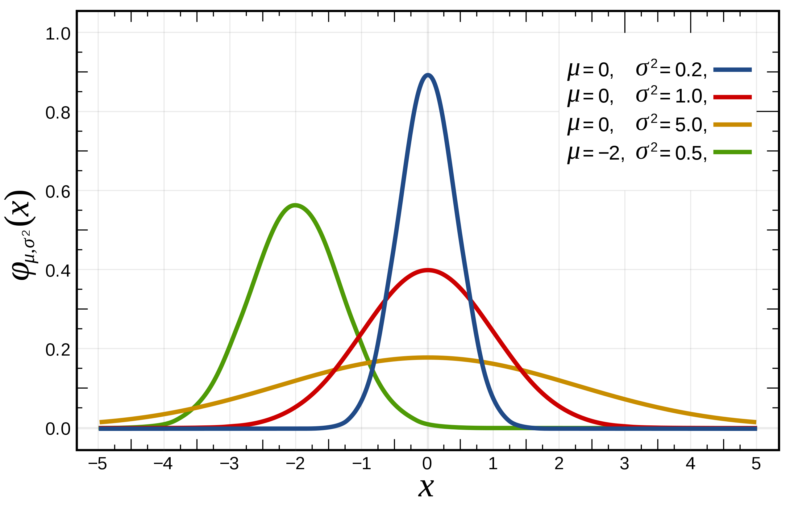

<a name=top><br>
  <p align=center>&nbsp;<a href="/README.md#top">home</a> ::
  <a href="/docs/syllabus.md#top">syllabus</a> ::
  <a href="https://docs.google.com/spreadsheets/d/16yxmklx4zvmfAHE7QocOQZZ4v4UxD5ktJHWMJEjBcMI/edit#gid=0">groups</a> ::
  <a href="/LICENSE.md#top">&copy;&nbsp;2024</a>, <a href="http:/timm.fyi">Tim Menzies</a><br>
  <a href="/README.md#top"></a></p>

# Some Details

(Warning... much examinable stuff follows.).

\newpage

# Effect Size

When experimenting with algorithms, it is good practice to ignore trivial differences; so called "small effect sizes".

But what does small mean?

Here are two populations with no overlap. The mean of Pop1 is clearly different to Pop2

Pop1: $\mu=2.9$: 1,2,2,3,3,3,3,4,4,5   
Pop2: $\mu=22$: 20,21,21,22,22,22,22,23,23,24

But what about Pop3,Pop4? Are their means from different populations? Well, the populations overlap so we have to be more careful.

Pop3: $\mu=2.9$: 1,2,2,3,3,3,3,4,4,5   
Pop4: $\mu=5$: 3,4,4,5,5,5,5,6,6,7


Lesson: we can't talk just about mean, we have to also reason about the spread.

- standard deviation, of $\sigma$ is a measure of diversity around the mean
- the tendancy of items in a population, not to be the mean
 
$$ \sigma = \sqrt{\frac{1}{N-1} \sum_{i=1}^N (x_i - \mu)^2} $$

{ width=500px }

- The more the variability, the wider the standard deviation and the lower the likelihood of the mean value.
- The less the variability, the narrower the standard deviation and the higher the likelihood of the mean

\newpage

Your NUM class contains code for incrementally updating what we know about means and standard deviations.
The small method suggests that some difference between two numbers in the same population is dull,
if thata different is less than .35 times standard deviation.

```lua
local NUM=is"NUM"
function NUM.new(s, n)
  return isa(NUM, {txt=s or " ", at=n or 0, n=0, mu=0, m2=0, hi=-1E30, lo=1E30,
              heaven = (s or ""):find"-$" and 0 or 1}) end

function NUM:add(x,     d)
  if x ~="?" then
    self.n  = self.n+1
    d       = x - self.mu
    self.mu = self.mu + d/self.n
    self.m2 = self.m2 + d*(x - self.mu)
    self.lo = math.min(x, self.lo)
    self.hi = math.max(x, self.hi) end end

function NUM:mid() return self.mu end
function NUM:div() return self.n < 2 and 0 or (self.m2/(self.n - 1))^.5 end
function NUM:small() return the.cohen*self:div() end -- the.cohen = .35
```

